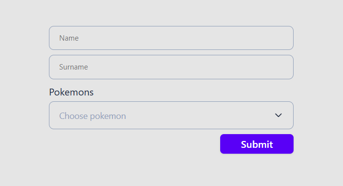

# Luna Edge Pokémon Team Builder [Live demo](pokemons-nine-mu.vercel.app/) 


## Overview

Luna Edge Pokémon Team Builder is a web application that allows users to create a Pokémon battle team. Users enter their name and surname, select a team of 4 Pokémon, and view their chosen team in a modal with Pokémon sprites.

## Features

- **User Form:** Input fields for first and last name.
- **Pokémon Selection:** Searchable select component to choose up to 4 Pokémon.
- **Real-time Validation:** Ensures names meet length and character restrictions, and exactly 4 Pokémon are selected before submission.
- **Pokémon Sprites Modal:** Displays chosen Pokémon in a visually appealing way.
- **Storybook Documentation:** Includes a well-documented select component with a filterable dropdown.
- **Fully Responsive UI:** Styled using Tailwind CSS.

## Tech Stack

- React
- TypeScript
- Axios
- Tailwind CSS
- Storybook
- React Hook Form

## Installation & Usage

### Prerequisites
Ensure you have [Node.js](https://nodejs.org/) and [Yarn](https://yarnpkg.com/) installed.

### Setup
Clone the repository and install dependencies:
```sh
git clone https://github.com/grizeus/pokemons.git
cd pokemons
yarn install
```

### Running the App
```sh
yarn vite
```

### Building for Production
```sh
yarn build
```

### Running Storybook
```sh
yarn storybook
```

## API Integration

- Pokémon data is fetched from [PokéAPI](https://pokeapi.co/).
- Axios handles all API requests.

## Contribution
Contributions are welcome! To contribute:
1. Fork the repository.
2. Create a new branch.
3. Commit your changes.
4. Submit a pull request.

## License
This project is licensed under the MIT License.

## Acknowledgments
Special thanks to the **PokéAPI** team for providing a free and open Pokémon database!

